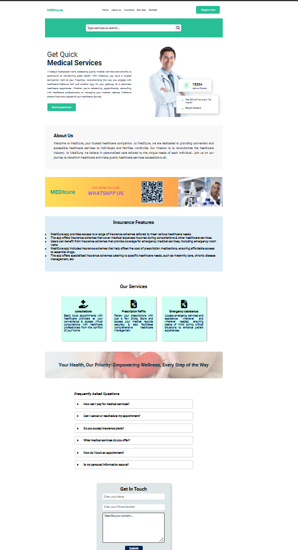

<h1 style="color:red; text-align:center;">Project README: MEDIcure Demo</h1>

This README provides a comprehensive overview of the structure, implementation, and functionality of the MEDIcure demo project, developed using HTML, CSS, and JavaScript.

https://github.com/tanmoy-12/MediCure/assets/146607626/1bb36ee6-f4f0-48a1-985a-adfa77d9f090

## ⏭Roadmap
- [x] landing page
- [x] Website Navbar & Header Section
- [x] About Us Section
- [x] Insurance Section
- [x] Services Section
- [x] FAQs
- [x] Get In Touch Section
- [x] Integrate Get In Touch functionality using JS and SMTP Protocol
- [x] Deploy on GITHUB PAGES

## 🛠️Tech Stack

-  **HTML 5** - for building the frontend    
- **CSS** - For UI component  
- **Font Awesome**- For UI ICON  
-  **Javascript**- for Element Functionality  
-  **Github Pages**- For Project Deployment 

<h2>HTML Structure</h2>

The HTML file (index.html) forms the structure of the MEDIcure web application. It comprises various sections, each serving a specific purpose:

<ul>
  <li>Navigation Bar: The navigation bar contains links to different sections of the application and includes buttons for user registration.</li>
  <li>Search Bar: The search bar can be used to search any services
  <li>Header: The header section showcases the main message of the application along with an image and additional content.</li>
  <li>About Us: This section provides information about MEDIcure's mission and values.</li>
  <li>Insurance Features: Here, users can explore the insurance schemes available through MEDIcure.</li>
  <li>Services Offered: Users can learn about the different services offered by MEDIcure, such as consultations and prescription refills.</li>
  <li>Get In Touch: This section allows users to submit their name, email, phone number, and message to get in touch with the MEDIcure team. It is useful during emergency purposes and giving feedback to our services</li>
  <li>Footer: The footer contains essential information about the application and its creators.</li>
</ul>

<h2>CSS Styling</h2>

The styles.css file contains styles to enhance the visual appeal and layout of the web application. It includes styles for the navigation bar, header, about us section, insurance features, services offered, get in touch section, and footer. The CSS rules ensure responsiveness across different screen sizes and provide a consistent user experience.

<h2>JavaScript Functionality</h2>

The script.js file contains JavaScript functions that add interactivity and functionality to the MEDIcure web application:

## 🙌 Overview

 

- In the landing page user can see the stats and interect with some features
- User can navigate to sections like-**Signin**,**Signup**, **About Us**,**Insurance Schemes**,**Services Offered**,**Contact**.
- After clicking on **Registration** button the user will be redirected to login page
- After clicking **Sign up** button user will redirect to sign up page and user have to enter details
- After clicking on the **nav-bar links** user will be redirected to that particular section of the website
- The user can browse through different elements of the page to see **Insurance Schemes**, **Services Offered**
- The user can browse through different **FAQs** to clear his doubts
- After entering proper information and querries in the **Contact Card** the user can send it via E-Mail by clicking on the Submit button 

## 🙌 Key Highlights

<ul>
  <li>Get In Touch Functionality: The submit button click event listener captures user input (name, phone number, email, and message) from the contact form. It constructs a mailto link with the user's information and the recipient's email address. Upon clicking the submit button, the function redirects the user to their default email client with the pre-filled message, allowing them to contact the MEDIcure team easily. Here I implemented this "Get in Touch" without using any backend technology. It is simply created by using javascript and SMTP protocol where the customer query will be directly send to the provided mail id.</li>
  
  <li>Navigation Links: Event listeners are added to the navigation links to enable smooth scrolling to different sections of the webpage. When users click on a navigation link, the page scrolls smoothly to the corresponding section.</li>
  
</ul>

<h2>Special Focus: Get In Touch Feature</h2>

The "Get In Touch" feature allows users to contact the MEDIcure team directly from the web application. It enhances user engagement and facilitates communication between users and the application creators. The JavaScript function associated with this feature simplifies the process of submitting inquiries or concerns, making it convenient for users to reach out to the MEDIcure team.

<h1>To access the live demo of MEDIcure, please visit: https://tanmoy-12.github.io/MediCure/</h1>

## 🌊Contributors

<h1 align="center">
 <b>Made with ❤️ by team PHOENIX
<h1>

<h2>Conclusion</h2>

The MEDIcure demo project demonstrates the integration of HTML, CSS, and JavaScript to create a responsive and interactive web application. Each element serves a specific purpose, contributing to the overall functionality and user experience of the application. The "Get In Touch" feature stands out as a key component, enabling seamless communication between users and the application creators.
